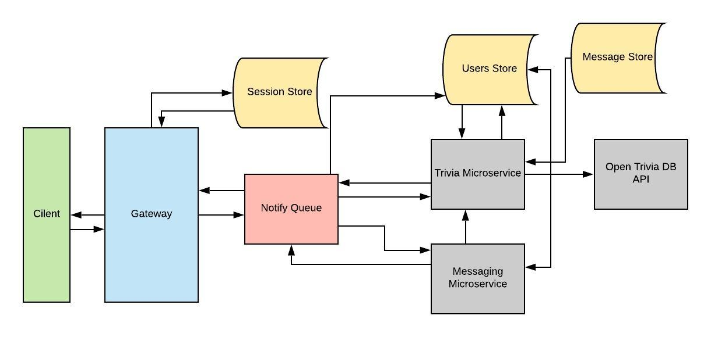
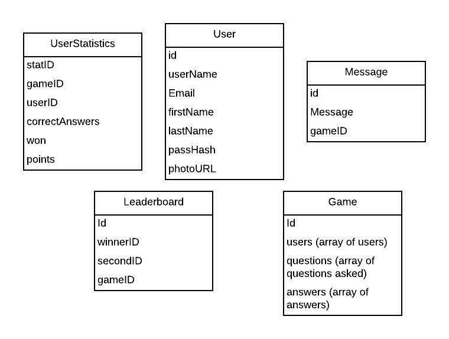

# TriviaRoulette
<html><head><meta content="text/html; charset=UTF-8" http-equiv="content-type"></head><body class="c38">

&nbsp; 

Trivia Roulette

02.27.2019

&#9472;

Jake Matray

Blake Franzen
<h1 class="c12" id="h.au51mny0sx6">Overview</h1>
Trivia Roulette is an application that lets users play trivia games with others in a format similar to popular battle royale games. 
<h1 class="c12" id="h.3at9u9s4e0vp">Who?</h1>
&nbsp;&nbsp;&nbsp;&nbsp;&nbsp;&nbsp;&nbsp;&nbsp;The specific target audience for this project are those that heavily enjoy trivia games, who are also looking to both show off and advance their knowledge in specific areas. We envision that those who want to put their knowledge to the test by competing against others in a fast-paced and challenging setting would be the ones most likely to use our application.
<h1 class="c12" id="h.4p7xi5bvhxdr">Why?</h1>
Despite the massive player base of Battle Royale video games, they are still missing the market of those that simply do not enjoy video games. Because the desire to compete and receive the satisfaction of being number one out of a large group of people is not solely found in people who enjoy video games, people would want to use our application to get that outlet they can&rsquo;t find elsewhere. If you are someone who enjoys trivia, whether it be by watching game shows or partaking in it themselves, or even just want to be able to show off how smart you are, you would be given the opportunity to measure your skills against others while also improving your own knowledge. 

As developers, this application is not only an opportunity to show off our skill set learned during the course but to also push the boundaries of our understanding of concepts. We hope that it will also introduce us to new technologies and services to broaden the scope of our knowledge as well. Most of all, we wanted to build a fun and engaging application to share with others. 
<h2 class="c11" id="h.56kfpodyq5td"></h2><h2 class="c11" id="h.ufdrm95hnfbc"></h2><h2 class="c11" id="h.jw7vkeu8knnt"></h2><h1 class="c12" id="h.yyrhu7ml5bea">Architecture</h1><h2 class="c35 c21" id="h.buwz1tcz7y35"></h2><h2 class="c11" id="h.dn5o68rgxjbb"></h2><h1 class="c12" id="h.byxssixdnqiq">User Stories</h1><table class="c27"><tbody><tr class="c20"><td class="c7" colspan="1" rowspan="1">
Priority
</td><td class="c0" colspan="1" rowspan="1">
User
</td><td class="c14" colspan="1" rowspan="1">
Description
</td><td class="c14" colspan="1" rowspan="1">
Implementation
</td></tr><tr class="c20"><td class="c7" colspan="1" rowspan="1">
P0
</td><td class="c0" colspan="1" rowspan="1">
As a user
</td><td class="c14" colspan="1" rowspan="1">
I want to create a new account with Trivia Roulette to play with others and track my progress 
</td><td class="c14" colspan="1" rowspan="1">
Upon receiving a POST request to /v1/users, UsersHandler will validate and insert a new user into the user store. UsersHandler will then begin a session for the new user in the session store
</td></tr><tr class="c20"><td class="c7" colspan="1" rowspan="1">
P1
</td><td class="c0" colspan="1" rowspan="1">
As a registered user
</td><td class="c14" colspan="1" rowspan="1">
I want to join a game and play against others players
</td><td class="c14" colspan="1" rowspan="1">
Upon recieivng a POST request to /v1/trivia/{triviaID}, the trivia microservice adds the authenticated user to the state of the desired game lobby
</td></tr><tr class="c20"><td class="c7" colspan="1" rowspan="1">
P1
</td><td class="c0" colspan="1" rowspan="1">
As a group of users
</td><td class="c14" colspan="1" rowspan="1">
I want to submit an answer to a question within a game
</td><td class="c14" colspan="1" rowspan="1">
After receiving a GET request to /v1/trivia/answer, containing a json list of users and their answers,&nbsp;the trivia microservice will determine which of the answers are correct, and respond with the list of users and whether or not they were correct.
</td></tr><tr class="c20"><td class="c7" colspan="1" rowspan="1">
P2
</td><td class="c0" colspan="1" rowspan="1">
As a registered user
</td><td class="c14" colspan="1" rowspan="1">
I want my statistics to be recorded after each game
</td><td class="c14" colspan="1" rowspan="1">
Upon receiving a POST request to /v1/users/{userID}, with a json object containing the number of correct answers, whether or not they won, and how many points they received for the game, and StatsHandler will insert that information into UserStatistics 
</td></tr><tr class="c20"><td class="c7" colspan="1" rowspan="1">
P3
</td><td class="c0" colspan="1" rowspan="1">
As a registered user
</td><td class="c14" colspan="1" rowspan="1">
I want to view my statistics, or another player&rsquo;s statistics
</td><td class="c14" colspan="1" rowspan="1">
Upon receiving a GET request to /v1/users/{userID}, StatsHandler will query the UserStatistics table for each with provided userID, and return a json object containing the sum for each statistic category
</td></tr><tr class="c20"><td class="c7" colspan="1" rowspan="1">
P2
</td><td class="c0" colspan="1" rowspan="1">
As a registered user
</td><td class="c14" colspan="1" rowspan="1">
I want to send chat messages to other players in my game
</td><td class="c14" colspan="1" rowspan="1">
Upon receiving a POST request to /v1/trivia/{triviaID}/messages, the messaging microservice will insert the message body and the associated triviaID into the Message table
</td></tr><tr class="c20"><td class="c7" colspan="1" rowspan="1">
P2
</td><td class="c0" colspan="1" rowspan="1">
As a registered user
</td><td class="c14" colspan="1" rowspan="1">
I want to view chat messages sent by other players in my game
</td><td class="c14" colspan="1" rowspan="1">
Upon receiving a GET request to /v1/trivia/{triviaID}/messages, the messaging microservice will respond with a list of all the messages for that game
</td></tr></tbody></table><h1 class="c12 c23" id="h.86k68ywjuxmo"></h1><h1 class="c12" id="h.u77jng2pdg6a">Schemas </h1>

Database 

<h1 class="c12" id="h.hhccp43185kw">Endpoints</h1>
The trivia microservice will handle the state of the game. The state will include a list of questions to ask and the users currently in the game. The service will generate a set of questions to ask users based on the API we are pulling from. After each question is answered by users in the alloted time those that didn&rsquo;t answer correctly will be removed from the game. 

POST /v1/users
<ul class="c13 lst-kix_68rx59yp9l3k-0 start"><li class="c2">Given a json object containing user information, including email, password, first name, last name, user name, and a photoURL, inserts the user into the user store</li><li class="c2">Returns the newly inserted user, along with their ID</li><li class="c2">Creates a session for the newly inserted user in the session store</li></ul>

GET /v1/users/{userID}
<ul class="c13 lst-kix_68rx59yp9l3k-0"><li class="c2">Given a userID, will return the user name and statistics for that specific userID </li></ul>
POST /v1/user/{userID}
<ul class="c13 lst-kix_68rx59yp9l3k-0"><li class="c2">Adds user game statistics to UserStatistics table after a game has been completed</li></ul>
POST /v1/trivia
<ul class="c13 lst-kix_68rx59yp9l3k-0"><li class="c2">Insert a new trivia game into the trivia microservice</li></ul>
POST /v1/trivia/{triviaID}
<ul class="c13 lst-kix_68rx59yp9l3k-0"><li class="c2">Add user to lobby</li></ul><ul class="c13 lst-kix_68rx59yp9l3k-1 start"><li class="c16 c19">Upgrade to websocket to send questions</li></ul><ul class="c13 lst-kix_68rx59yp9l3k-0"><li class="c2">Start game if time runs out on lobby waiting</li></ul>
GET /v1/trivia/{triviaID}/answer
<ul class="c13 lst-kix_273kfjdt8vdw-0 start"><li class="c2">User sends answer to question</li><li class="c2">Game state updated</li><li class="c2">If answer incorrect user removed from state</li><li class="c2">Send user result of answer</li></ul>
POST /v1/trivia/{triviaID}/messages
<ul class="c13 lst-kix_68rx59yp9l3k-0"><li class="c2">Inserts the message body and the creator of the message into the messaging microservice</li></ul>
GET /v1/trivia/{triviaID}/message
<ul class="c13 lst-kix_68rx59yp9l3k-0"><li class="c2">Returns all messages for the request trivia game, along with their creators</li></ul>

We will also utilize the API endpoints we defined in assignments throughout the quarter for signing users up, storing session information for active users, and sending/receiving messages. 
</body></html>
